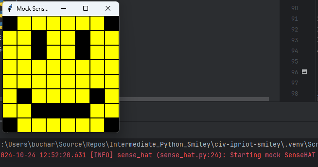
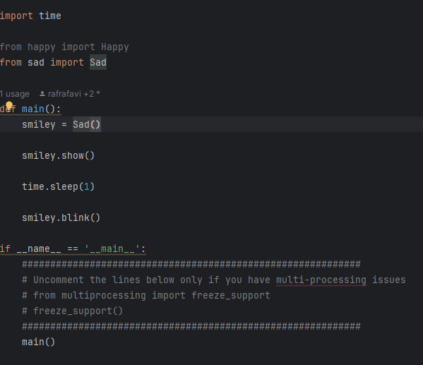

<style>

body {
    counter-reset: h2counter;
}

/* H1 - No numbering */
h1 {
    /* No counter reset or increment */
}

/* H2 - Level 1 numbering */
h2 {
    counter-reset: h3counter;
}

h2::before {
    counter-increment: h2counter;
    content: counter(h2counter) ". ";
}

/* H3 - Level 2 numbering */
h3 {
    counter-reset: h4counter;
}

h3::before {
    counter-increment: h3counter;
    content: counter(h2counter) "." counter(h3counter) " ";
}

/* H4 - Level 3 numbering (optional) */
h4 {
    counter-reset: h5counter;
}

h4::before {
    counter-increment: h4counter;
    content: counter(h2counter) "." counter(h3counter) "." counter(h4counter) " ";
}

</style>

# Evidence and Knowledge

This document includes instructions and knowledge questions that must be completed to receive a *Competent* grade on this portfolio task.

## Required evidence

### Answer all questions in this document

- Each answer should be complete, well-articulated, and within the specified word count limits (if added) for each question.
- Please make sure **all** external sources are properly cited.
- You must **use your own words**. Please include your full chat transcripts if you use generative AI in any way.
- Generative AI hallucinates, is not an authoritative source

### Make all the required modifications to the code

- Please follow the instructions in this document to make the changes needed to the code.

- When requested to upload evidence, upload all screenshots to `screenshots/` and embed them in this document. For example:

```markdown

```

- You must upload the code into your GitHub repository.
- While you can use a branch, your code should be in main when you submit.
- Upload a zip of this repository to Blackboard when you are ready to submit.
- You will be notified of your result via Blackboard
- However, if using GitHub classrooms, you may also receive additional feedback on GitHub directly

### Optional: Use of Raspberry Pi and SenseHat

Raspberry Pi or SenseHat is **optional** for this activity. You can use the included `sense_hat.py` file to simulate the SenseHat on your computer.

If you use a Pi, please **delete** the `sense_hat.py` file.

### Accessible version of the code

This project relies on visual patterns that appear on an LED matrix. If you have any accessibility requirements, you can use the `udl/accessible` branch to complete the project. This branch provides an accessible code version that uses text-based patterns instead of visual ones.

Please discuss this with your lecturer before using that branch.

## Specific Tasks & Questions

Address the following tasks and questions based on the code provided in this repository.

### Set up the project locally

1. Fork this repository (if not using GitHub Classrooms)
2. Clone your repository locally
3. Run the project locally by executing the `main.py` file
4. Evidence this by providing screenshots of the project directory structure and the output of the `main.py` file



If you are running on a Raspberry Pi, you can use the following command to run the project and then screenshot the result:

```bash
ls
python3 main.py
```

### Fundamental code comprehension

 Answer each of the following questions **as they relate to that code** supplied by in this repository (ignore `sense_hat.py`):

1. Examine the code for the `smiley.py` file and provide  an example of a variable of each of the following types and their corresponding values (`_` should be replaced with the appropriate values):

   | Type                    | name   | value         |
   | ----------              |--------|---------------|
   | built-in primitive type | dimmed | True          |
   | built-in composite type | YELLOW | (0, 255, 255) |
   | user-defined type       | Smiley | _             |

2. Fill in (`_`) the following table based on the code in `smiley.py`:

   | Object                   | Type   |
   | ------------             |--------|
   | self.pixels              | List   |
   | A member of self.pixels  | Tuple  |
   | self                     | Smiley |

3. Examine the code for `smiley.py`, `sad.py`, and `happy.py`. Give an example of each of the following control structures using an example from **each** of these files. Include the first line and the line range:

   | Control Flow | File      | First line | Line range |
   | ------------ |-----------|------------|------------|
   |  sequence    | Smiley.py | 15         | 11         |
   |  selection   | Happy.py  | 31         | 1          |
   |  iteration   | Sad.py    | 16         | 2          |

4. Though everything in Python is an object, it is sometimes said to have four "primitive" types. Examining the three files `smiley.py`, `sad.py`, and `happy.py`, identify which of the following types are used in any of these files, and give an example of each (use an example from the code, if applicable, otherwise provide an example of your own):

   | Type                    | Used?     | Example               |
   | ----------------------- |-----------|-----------------------|
   | int                     | Smiley.py | WHITE (tuple of ints) |
   | float                   | Happy.py  | Delay                 |
   | str                     | No        | name = "Larry"        |
   | bool                    | Smiley.py | dimmed                |

5. Examining `smiley.py`, provide an example of a class variable and an instance variable (attribute). Explain **why** one is defined as a class variable and the other as an instance variable.


> The pixel colors (such as WHITE = (255, 255, 255)) in smiley.py are class variables. while the pixels used to build the smiley (Y = self.YELLOW, O = self.BLANK) are instance variables. the colors are set as class values as the supplied RGB values will always output the same color. The Y and O variables are instance variables to allow a user to change the color in one instance of the smiley.

6. Examine `happy.py`, and identify the constructor (initializer) for the `Happy` class:
   1. What is the purpose of a constructor (in general) and this one (in particular)?

   > A constructor is used to create an instance of a class in python, it is used in the happy.py to create an instance of the pixel layout from smiley.py 
   

   2. What statement(s) does it execute (consider the `super` call), and what is the result?

   > the super() call executes the statements within the Smiley class that Happy inherits from. meaning that apart from the draw_mouth, draw_eyes and blink functions, Happy also calls the show function from the main smiley class
   

### Code style

1. What code style is used in the code? Is it likely to be the same as the code style used in the SenseHat? Give to reasons as to why/why not:
   
> The code style in this code is PEP8. It is likely that the sensehat code follows the same coding style, this is because the dim display and show functions in smiley.py call upon sensehat variables that utilise snake case
>

2. List three aspects of this convention you see applied in the code.

> 1. variables being snake_case 2. constants being all UPPERCASE 3. classes being PascalCase


3. Give two examples of organizational documentation in the code.

> Single line comment in smiley.py on line 13, docstrings within the functions of smiley.py, happy.py and sad.py


### Identifying and understanding classes

> Note: Ignore the `sense_hat.py` file when answering the questions below

1. List all the classes you identified in the project. Indicate which classes are base classes and which are subclasses. For subclasses, identify all direct base classes.
  
  Use the following table for your answers:

| Class Name | Super or Sub? | Direct parent(s) |
|------------|---------------|------------------|
| NotReal    | Sub           | NotRealParent    |
| Smiley     | Super         | -                |
| Blinkable  | Super         | -                |
| Happy      | Sub           | Smiley           |
| sad        | Sub           | Smiley           |
| SenseHat   | Super         | -                |


2. Explain the concept of abstraction, giving an example from the project (note "implementing an ABC" is **not** in itself an example of abstraction). (Max 150 words)

> Abstraction in python hides the complexity of the code by showing only the essential features and not the underlying implementation. In this program, Blinkable is defined as an abstract method, which allows any class to blink if given the Blinkable method.
>

3. What is the name of the process of deriving from base classes? What is its purpose in this project? (Max 150 words)

> The name for the process of deriving from base classes is inheritance. in this project, the purpose is to allow multiple difference faces(classes) to inherit their functions from the main smiley class
>

### Compare and contrast classes

Compare and contrast the classes Happy and Sad.

1. What is the key difference between the two classes?
   > They key difference between the two classes are that only happy.py has the blink function available to it, and that the mouth is drawn with different pixel coordinates. Also the draw eyes function is written differently.
   >
2. What are the key similarities?
   > both Happy.py and Sad.py inherit their main functionality from the base Smiley class, such as the drawn pixels, colors and display function
   >
3. What difference stands out the most to you and why?
   > the lack of the blinkable class(and therefore the ability to use the blink function) in Sad.py stands out as the largest difference between the two classes.
   >
4. How does this difference affect the functionality of these classes
   > This difference between the two is, without the blinkable class being available to Sad.py, it cannot utilise the blink function.
   >

### Where is the Sense(Hat) in the code?

1. Which class(es) utilize the functionality of the SenseHat?
   > the Smiley class, (and therefore its subclasses happy and sad) utilize the functionality of SenseHat to draw and display the smiley
   >
2. Which of these classes directly interact with the SenseHat functionalities?
   > only the Smiley class directly interacts with SenseHat, happy and sad only refer back to Smileys interaction with SenseHat
   >
3. Discuss the hiding of the SenseHAT in terms of encapsulation (100-200 Words)
   > The encapsulation of the SenseHat class means that the inner workings of the SenseHat itself (such as the code defining the GUI) are hidden when working on the smileys themselves, as you do not need to understand the individual functions of the SenseHat itself to modify or create new smileys. For example, the only functions from the senseHat that you can access are the set_pixels method and low_light property.
    
   > Additionally, this also allows you to switch from the mock SenseHat to a real SenseHAT on a Raspberry pi without having to modify the code for displaying the smiley itself. 
   

### Sad Smileys Can’t Blink (Or Can They?)

Unlike the `Happy` smiley, the current implementation of the `Sad` smiley does not possess the ability to blink. Let's first explore how blinking has been implemented in the Happy Smiley by examining the blink() method, which takes one argument that determines the duration of the blink.

**Understanding Blink Mechanism:**

1. Does the code's author believe that every `Smiley` should be able to blink? Explain.

> No, not all smileys should be able to blink, if this were the case, the base class Smiley would have the Blinkable class assigned to it for all smileys to inherit from it.
>

2. For those smileys that blink, does the author expect them to blink in the same way? Explain.

> No, the blink function itself is defined in the individual "happy" smiley. for this reason, all other smileys that are given the blinkable functionality can be given different parameters for the blink function itself.
>

3. Referring to the implementation of blink in the Happy and Sad Smiley classes, give a brief explanation of what polymorphism is.

> Currently, the blink function is not really polymorphic, as it is only defined in the happy smiley class, however it can be implemented. Polymorphism is the ability to use the same function in different ways depending on its implementation within the class. As an example, the blink function within the sad smiley could be written differently but still inherit from the blinkable class.
>

4. How is inheritance used in the blink method, and why is it important for polymorphism?

> THe blink method inherits from the blinkable class, allowing for a polymorphic blink function that doesn't function the same way in every implementation
>
1. **Implement Blink in Sad Class:**

   - Create a new method called `blink` within the Sad class. Ensure you use the same method signature as in the Happy class:

   ```python
       def blink(self, delay=0.5):
        """
       Blinks the smiley's eyes once

        :param delay: Delay between blinks (in seconds)
        """
        while True:
            self.draw_eyes(True)
            self.show()
            time.sleep(delay)
            self.draw_eyes(False)
            self.show()
            time.sleep(0.05)
            self.draw_eyes(True)
            self.show()
            time.sleep(0.05)
            self.draw_eyes(False)
            self.show()
            time.sleep(0.05)
   ```

2. **Code Implementation:** Implement the code that allows the Sad smiley to blink. Use the implementation from the Happy Smiley as a reference. Ensure your new method functions similarly by controlling the blink duration through the `delay` argument.

3. **Testing the Implementation:**

- Test the new blink functionality on your Raspberry Pi or within the Python classes provided. You might need to adjust the `main.py` script to incorporate Sad Smiley's new blinking capability.

Include a screenshot of the sad smiley or the modified `main.py`:



- Observe and document the Sad smiley as it blinks its eyes. Describe any adjustments or issues encountered during implementation.

  > I implemented a while loop to make the smiley continue to blink

  ### If It Walks Like a Duck…

  Previously, you implemented the blink functionality for the Sad smiley without utilizing the class `Blinkable`. Assuming you did not use `Blinkable` (even if you actually did), consider how the Sad smiley could blink similarly to the Happy smiley without this specific class.

  1. **Class Type Analysis:** What kind of class is `Blinkable`? Inspect its superclass for clues about its classification.

     > Blinkable is an abstract class

  2. **Class Implementation:** `Blinkable` is a class intended to be implemented by other classes. What generic term describes this kind of class, which is designed for implementation by others? **Clue**: Notice the lack of any concrete implementation and the naming convention.

  > Your answer here

  3. **OO Principle Identification:** Regarding your answer to question (2), which Object-Oriented (OO) principle does this represent? Choose from the following and justify your answer in 1-2 sentences: Abstraction, Polymorphism, Inheritance, Encapsulation.

  > Your answer here

  4. **Implementation Flexibility:** Explain why you could grant the Sad Smiley a blinking feature similar to the Happy Smiley's implementation, even without directly using `Blinkable`.

  > Your answer here

  5. **Concept and Language Specificity:** In relation to your response to question (4), what is this capability known as, and why is it feasible in Python and many other dynamically typed languages but not in most statically typed programming languages like C#? **Clue** This concept is hinted at in the title of this section.

  > Your answer here

  ***

  ## Refactoring

  ### Does a Smiley Have to Be Yellow?

  While our current implementation predominantly features yellow smileys, emotional expressions like sickness or anger typically utilize colors like green, red, or orange. We'll explore the feasibility of integrating these colors into our smileys.

  1. **Defined Colors and Their Location:**

     1. Which colors are defined and in which class(s)?
        > Your answer here
     2. What type of variables hold these colors? Are the values expected to change during the program's execution? Explain your answer.
        > Your answer here
     3. Add the color blue to the appropriate class using the appropriate format and values.

  2. **Usage of Color Variables:**

     1. In which classes are the color variables used?
        > Your answer here

  3. **Simple Method to Change Colors:**
  4. What is the easiest way you can think to change the smileys to green? Easiest, not necessarily the best!
     > Your answer here

  Here's a revised version of the "Flexible Colors – Step 1" section for the smiley project, incorporating your specifications for formatting and content updates:

  ### Flexible Colors – Step 1

  Changing the color of the smileys once is straightforward, but it isn't very flexible. To facilitate various colors for smileys, it is advisable not to hardcode values in any class. This approach was identified earlier as a necessary change. Let's start by removing the built-in assumptions about color in our classes.

  1. **Add a method called `complexion` to the `Smiley` class:** Implement this instance method to return `self.YELLOW`. Using the term "complexion" instead of "color" provides a more abstract terminology that focuses on the meaning rather than implementation.

  2. **Refactor subclasses to use the `complexion` method:** Modify any subclass that directly accesses the color variable to instead utilize the new `complexion` method. This ensures that color handling is centralized and can be easily modified in the future.

  3. **Determine the applicable Object-Oriented principle:** Consider whether Abstraction, Polymorphism, Inheritance, or Encapsulation best applies to the modifications made in this step.

  4. **Verify the implementation:** Ensure that the modifications function as expected. The smileys should still display in yellow, confirming that the new method correctly replaces the direct color references.

  This step is crucial for setting up a more flexible system for color management in the smiley display logic, allowing for easy adjustments and extensions in the future.

  ### Flexible Colors – Step 2

  Having removed the hardcoded color values, we now enhance the base class to support dynamic color assignments more effectively.

  1. **Modify the `__init__()` method in the `Smiley` class:** Introduce a default argument named `complexion` and assign `YELLOW` as its default value. This allows the instantiation of smileys with customizable colors.

  2. **Introduce a new instance variable:** Create a variable called `my_complexion` and assign the `complexion` parameter to it. This step ensures that each smiley instance can maintain its own color state.

  3. **Rationale for `my_complexion`:** Using a distinct instance variable like `my_complexion` avoids potential conflicts with the method parameter names and clarifies that it is an attribute specific to the object.

  4. **Bulk rename:** We want to update our grid to use the value of complexion, but we have so many `Y`'s in the grid. Use your IDE's refactoring tool to rename all instances of the **symbol** `Y` to `X`. Where `X` is the value of the `complexion` variable. Include a screenshot evidencing you have found the correct refactor tool and the changes made.

  

  5. **Update the `complexion` method:** Adjust this method to return `self.my_complexion`, ensuring that whatever color is assigned during instantiation is what the smiley displays.

  6. **Verification:** Run the updated code to confirm that Smileys still defaults to yellow unless specified otherwise.

  ### Flexible Colors – Step 3

  With the foundational changes in place, it's now possible to implement varied smiley colors for different emotional expressions.

  1. **Adjust the `Sad` class initialization:** In the `Sad` class's initializer method, change the superclass call to include the `complexion` argument with the value `self.BLUE`, as shown:

     ```python
     super().__init__(complexion=self.BLUE)
     ```

  2. **Test color functionality for the Sad smiley:** Execute the program to verify that the Sad smiley now appears blue.

  3. **Ensure the Happy smiley remains yellow:** Confirm that changes to the Sad smiley do not affect the default color of the Happy smiley, which should still display in yellow.

  4. **Design and Implement An Angry Smiley:** Create an Angry smiley class that inherits from the `Smiley` class. Set the color of the Angry smiley to red by passing `self.RED` as the `complexion` argument in the superclass call.

  ***
