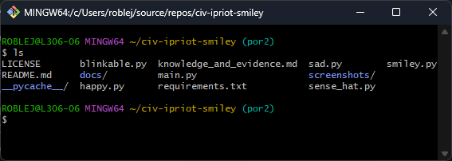
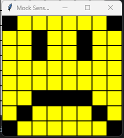

<style>

body {
    counter-reset: h2counter;
}

/* H1 - No numbering */
h1 {
    /* No counter reset or increment */
}

/* H2 - Level 1 numbering */
h2 {
    counter-reset: h3counter;
}

h2::before {
    counter-increment: h2counter;
    content: counter(h2counter) ". ";
}

/* H3 - Level 2 numbering */
h3 {
    counter-reset: h4counter;
}

h3::before {
    counter-increment: h3counter;
    content: counter(h2counter) "." counter(h3counter) " ";
}

/* H4 - Level 3 numbering (optional) */
h4 {
    counter-reset: h5counter;
}

h4::before {
    counter-increment: h4counter;
    content: counter(h2counter) "." counter(h3counter) "." counter(h4counter) " ";
}

</style>

# Evidence and Knowledge

This document includes instructions and knowledge questions that must be completed to receive a *Competent* grade on this portfolio task.

## Required evidence

### Answer all questions in this document

- Each answer should be complete, well-articulated, and within the specified word count limits (if added) for each question.
- Please make sure **all** external sources are properly cited.
- You must **use your own words**. Please include your full chat transcripts if you use generative AI in any way.
- Generative AI hallucinates, is not an authoritative source

### Make all the required modifications to the code

- Please follow the instructions in this document to make the changes needed to the code.

- When requested to upload evidence, upload all screenshots to `screenshots/` and embed them in this document. For example:

```markdown

```

- You must upload the code into your GitHub repository.
- While you can use a branch, your code should be in main when you submit.
- Upload a zip of this repository to Blackboard when you are ready to submit.
- You will be notified of your result via Blackboard
- However, if using GitHub classrooms, you may also receive additional feedback on GitHub directly

### Optional: Use of Raspberry Pi and SenseHat

Raspberry Pi or SenseHat is **optional** for this activity. You can use the included `sense_hat.py` file to simulate the SenseHat on your computer.

If you use a Pi, please **delete** the `sense_hat.py` file.

### Accessible version of the code

This project relies on visual patterns that appear on an LED matrix. If you have any accessibility requirements, you can use the `udl/accessible` branch to complete the project. This branch provides an accessible code version that uses text-based patterns instead of visual ones.

Please discuss this with your lecturer before using that branch.

## Specific Tasks & Questions

Address the following tasks and questions based on the code provided in this repository.

### Set up the project locally

1. Fork this repository (if not using GitHub Classrooms)
2. Clone your repository locally
3. Run the project locally by executing the `main.py` file
4. Evidence this by providing screenshots of the project directory structure and the output of the `main.py` file



If you are running on a Raspberry Pi, you can use the following command to run the project and then screenshot the result:

```bash
ls
python3 main.py
```

### Fundamental code comprehension

 Answer each of the following questions **as they relate to that code** supplied by in this repository (ignore `sense_hat.py`):

1. Examine the code for the `smiley.py` file and provide  an example of a variable of each of the following types and their corresponding values (`_` should be replaced with the appropriate values):

   | Type                    | name   | value            |
   | ----------              |--------|------------------|
   | built-in primitive type | int    | 255              |
   | built-in composite type | WHITE  | (255, 255, 255)  |
   | user-defined type       | Smiley | Class            |

2. Fill in (`_`) the following table based on the code in `smiley.py`:

   | Object                   | Type  |
   | ------------             |-------|
   | self.pixels              | array |
   | A member of self.pixels  | int   |
   | self                     | class |

 Examine the code for `smiley.py`, `sad.py`, and `happy.py`. Give an example of each of the following control structures using an example from **each** of these files. Include the first line and the line range:

   | Control Flow | File      | First line                           | Line range |
   |--------------|-----------|--------------------------------------|------------|
   | sequence     | sad.py    | self.draw_mouth()                    | 8-9        |
   |              | smiley.py | Y = self.YELLOW                      | 15-26      | 
   |              | happy.py  | self.draw_eyes(wide_open=False       | 39-43      |
   | selection    | smiley.py | def dim_display(self, dimmed=True):  | 28-33      |
   |              | sad.py    | def draw_eyes(self, wide_open=True): | 19-30      |
   |              | happy.py  | def draw_eyes(self, wide_open=True): | 24-31      |
   | iteration    | smiley.py | _                                    | _          |
   |              | sad.py    | for pixel in eyes:                   | 25-30      |
   |              | happy.py  | for pixel in eyes:                   | 30-31      |


4. Though everything in Python is an object, it is sometimes said to have four "primitive" types. Examining the three files `smiley.py`, `sad.py`, and `happy.py`, identify which of the following types are used in any of these files, and give an example of each (use an example from the code, if applicable, otherwise provide an example of your own):

   | Type                    | Used? | Example                      |
   | ----------------------- |-------|------------------------------|
   | int                     | No    | _                            |
   | float                   | Yes   | delay = 0.25 (happy.py)      |
   | str                     | No    | _                            |
   | bool                    | Yes   | wide_open = False (happy.py) |

5. Examining `smiley.py`, provide an example of a class variable and an instance variable (attribute). Explain **why** one is defined as a class variable and the other as an instance variable.

> An example of a class variable would be WHITE and an instance variable would be Y. The 
> reason for the difference is that, WHITE would stay the same throughout the class but Y 
> could go through changes depending on which function it is part of.

6. Examine `happy.py`, and identify the constructor (initializer) for the `Happy` class:
   1. What is the purpose of a constructor (in general) and this one (in particular)?

   > In general, the constructor is used to initialize the object and set default values for 
   > attributes. In this case, however, the constructor was used to call upon a function 
   > rather than initializing.
   >

   2. What statement(s) does it execute (consider the `super` call), and what is the result?

   > It executes the draw_mouth and draw_eyes statements. The results draw the eyes and the 
   > mouth of the happy face.
   >

### Code style

1. What code style is used in the code? Is it likely to be the same as the code style used in the SenseHat? Give to reasons as to why/why not:
   
> PEP 8. Yes because PEP 8 is the standard coding convention for Python code writing.
>

2. List three aspects of this convention you see applied in the code.

> Indentations are being used correctly. Maximum character being used per line is 79 
> characters. Using lowercase with underscores to name the functions and variables.
>

3. Give two examples of organizational documentation in the code.

> happy.py line 17-19, and smiley.py line 29-33. Both of these helped me to understand the 
code better.
>

### Identifying and understanding classes

> Note: Ignore the `sense_hat.py` file when answering the questions below

1. List all the classes you identified in the project. Indicate which classes are base classes and which are subclasses. For subclasses, identify all direct base classes.
  
  Use the following table for your answers:

| Class Name   | Super or Sub? | Direct parent(s)  |
|--------------|---------------|-------------------|
| blinkable.py | Super         | N/A               |
| smiley.py    | Super         | N/A               |
| sad.py       | Sub           | smiley            |
| happy.py     | Sub           | smiley, blinkable |
|              |               |                   | 

2. Explain the concept of abstraction, giving an example from the project (note "implementing an ABC" is **not** in itself an example of abstraction). (Max 150 words)

> The concept of abstraction is to show the objects in how they are used and not how they 
> are implemented or work. With this particular program, to know how the code outputs smiley, 
> I only need to look at smiley.py to understand how it's getting displayed. I don't need to 
> look at or understand the deeper and more complex code in sense_hat.py
>

3. What is the name of the process of deriving from base classes? What is its purpose in this project? (Max 150 words)

> The process is called inheritance. Its purpose in this project is to call upon other 
> classes and change their pixels instead of closing the current class and making a new 
> emoji with the new class.
>

### Compare and contrast classes

Compare and contrast the classes Happy and Sad.

1. What is the key difference between the two classes?
   > happy has an additional method which uses the module time to delay and show an 
   > animation of blinking. Which is something that sad doesn't have.
   >
2. What are the key similarities?
   > Happy and Sad both use arrays to save values within the methods
   >
3. What difference stands out the most to you and why?
   > The usage of delay and Time in happy stands out the most for me because I haven't seen 
   > such usage for libraries before.
   >
4. How does this difference affect the functionality of these classes
   > The functionality of happy offers much more than sad within the application, the 
   > blinking of the emoji gives the happy class much more personality and makes the user 
   > feel more certain about the effort put into the application
   >

### Where is the Sense(Hat) in the code?

1. Which class(es) utilize the functionality of the SenseHat?
   > Smiley, Happy and Sad utilize SenseHat's functionality.
   >
2. Which of these classes directly interact with the SenseHat functionalities?
   > Only smiley interacts directly with the functionalities of SenseHat
   >
3. Discuss the hiding of the SenseHAT in terms of encapsulation (100-200 Words)
   > The encapsulation of SenseHat was done through the use of Smiley class within the program, 
   > there was a single instance of usage of SenseHat, and it was done in Smiley. Within 
   > Smiley, the SenseHat was initialized. From then and onwards, other classes referenced and 
   > used Smiley not SenseHat. With this, everyone only needs to refer to the smiley 
   > class to understand what's happening within sad and happy. And within smiley class, the 
   > user can see how the emoji and its pixels were implemented, how the colours were added 
   > to the program without needing to understand what made these implementations possible.
   >

### Sad Smileys Can’t Blink (Or Can They?)

Unlike the `Happy` smiley, the current implementation of the `Sad` smiley does not possess the
ability to blink. Let's first explore how blinking has been implemented in the Happy Smiley by 
examining the blink() method, which takes one argument that determines the duration of the blink.

**Understanding Blink Mechanism:**

1. Does the code's author believe that every `Smiley` should be able to blink? Explain.

> No, because the child-class of 'blinkable' is only the 'happy' class


2. For those smileys that blink, does the author expect them to blink in the same way? Explain.

> No, because there could be different delays based on different smileys


3. Referring to the implementation of blink in the Happy and Sad Smiley classes, give a brief explanation of what polymorphism is.

>If blink were to be implemented in Sad class, the delay could be of different values. The 
> structure of the blink function would be same but throughout different classes, there 
> would be different ways to implement them.

4. How is inheritance used in the blink method, and why is it important for polymorphism?

> Inheritance is used in the blink method to build the framework to be used by other classes.
>
1. **Implement Blink in Sad Class:**

   - Create a new method called `blink` within the Sad class. Ensure you use the same method signature as in the Happy class:

   ```python
   def blink(self, delay=0.25):
       pass  # Replace 'pass' with your implementation
   ```

2. **Code Implementation:** Implement the code that allows the Sad smiley to blink. Use the implementation from the Happy Smiley as a reference. Ensure your new method functions similarly by controlling the blink duration through the `delay` argument.

3. **Testing the Implementation:**

- Test the new blink functionality on your Raspberry Pi or within the Python classes provided. You might need to adjust the `main.py` script to incorporate Sad Smiley's new blinking capability.

Include a screenshot of the sad smiley or the modified `main.py`:



- Observe and document the Sad smiley as it blinks its eyes. Describe any adjustments or issues encountered during implementation.

  > I had to import Blinkable method from blinkable module to sad class and had to import it 
  > to main from sad afterwards.

  ### If It Walks Like a Duck…

  Previously, you implemented the blink functionality for the Sad smiley without utilizing the
- class `Blinkable`. Assuming you did not use `Blinkable` (even if you actually did), consider 
- how the Sad smiley could blink similarly to the Happy smiley without this specific class.

  1. **Class Type Analysis:** What kind of class is `Blinkable`? Inspect its superclass for clues about its classification.

     >The superclass of `Blinkable` is ABC which stands for abstract base class, it is used to standardize
> the way of testing whether the object adheres to a given specification.
> (Abstract Base Class (abc) in Python. (2020, August 20). GeeksforGeeks. https://www.geeksforgeeks.org/abstract-base-class-abc-in-python/)

  2. **Class Implementation:** `Blinkable` is a class intended to be implemented by other classes.
  What generic term describes this kind of class, which is designed for implementation by others? **Clue**: Notice the lack of any concrete implementation and the naming convention.

  > The class `Blinkable` falls under the abstract class

  3. **OO Principle Identification:** Regarding your answer to question (2), which Object-Oriented (OO) principle does this represent? Choose from the following and justify your answer in 1-2 sentences: Abstraction, Polymorphism, Inheritance, Encapsulation.

  > The principle Abstraction is used in the class `Blinkable`, Blinkable is there to show the user what the Blink function is supposed to do. 
> Due to this, the user wouldn't need to look through other classes to see how happy or sad blinks.

  4. **Implementation Flexibility:** Explain why you could grant the Sad Smiley a blinking feature similar to the Happy Smiley's implementation, even without directly using `Blinkable`.

  > Blinkable is only there to show how the method `Blink` is supposed to operate. Because I added the method `Blink` to the `sad` class,
> I didn't need to inherit the `Blinkable` class.

  5. **Concept and Language Specificity:** In relation to your response to question (4), what is this capability known as, and why is it feasible in Python and many other dynamically typed languages but not in most statically typed programming languages like C#? **Clue** This concept is hinted at in the title of this section.

  > In python, everything is an object, so composition is easy to implement in Python. In languages like C#, you have to
> create the object yourself. Thus making it feasible for dynamically typed languages.

  ***

  ## Refactoring

  ### Does a Smiley Have to Be Yellow?

  While our current implementation predominantly features yellow smileys, emotional expressions like sickness or anger typically utilize colors like green, red, or orange. We'll explore the feasibility of integrating these colors into our smileys.

  1. **Defined Colors and Their Location:**

     1. Which colors are defined and in which class(s)?
        > WHITE, GREEN, RED, YELLOW, BLANK are defined in the `smiley` class.

     2. What type of variables hold these colors? Are the values expected to change during the program's execution? Explain your answer.
        > In smiley, the variable `YELLOW` holds the yellow colour. 
        > Yes during execution, some of the yellow colour in `smiley` class is expected to change to BLANK to show the
        > eyes and mouth. And the eyes are expected to change to yellow if `blink` is implemented.
     3. Add the color blue to the appropriate class using the appropriate format and values.
         > "Done"

  2. **Usage of Color Variables:**

     1. In which classes are the color variables used?
        > The color variables are used in sad, happy and smiley.

  3. **Simple Method to Change Colors:**
  4. What is the easiest way you can think to change the smileys to green? Easiest, not necessarily the best!
     > Change Y = self.YELLOW to Y = self.GREEN

  Here's a revised version of the "Flexible Colors – Step 1" section for the smiley project, incorporating your specifications for formatting and content updates:

  ### Flexible Colors – Step 1

  Changing the color of the smileys once is straightforward, but it isn't very flexible. To facilitate various colors for smileys, it is advisable not to hardcode values in any class. This approach was identified earlier as a necessary change. Let's start by removing the built-in assumptions about color in our classes.

  1. **Add a method called `complexion` to the `Smiley` class:** Implement this instance method to return `self.YELLOW`. Using the term "complexion" instead of "color" provides a more abstract terminology that focuses on the meaning rather than implementation.
      >Done      

  2. **Refactor subclasses to use the `complexion` method:** Modify any subclass that directly accesses the color variable to instead utilize the new `complexion` method. This ensures that color handling is centralized and can be easily modified in the future.
      >Done
   
  3. **Determine the applicable Object-Oriented principle:** Consider whether Abstraction, Polymorphism, Inheritance, or Encapsulation best applies to the modifications made in this step.
      > Abstraction fits modifications that has been done by Q3. Because the user would only need to look at complexion 
> understand that it is showing the emoji's colour, they do not need to go to smiley.

  4. **Verify the implementation:** Ensure that the modifications function as expected. The smileys should still display in yellow, confirming that the new method correctly replaces the direct color references.
      >Verified

  This step is crucial for setting up a more flexible system for color management in the smiley display logic, allowing for easy adjustments and extensions in the future.

  ### Flexible Colors – Step 2

  Having removed the hardcoded color values, we now enhance the base class to support dynamic color assignments more effectively.

  1. **Modify the `__init__()` method in the `Smiley` class:** Introduce a default argument named `complexion` and assign `YELLOW` as its default value. This allows the instantiation of smileys with customizable colors.
      >Done
  2. **Introduce a new instance variable:** Create a variable called `my_complexion` and assign the `complexion` parameter to it. This step ensures that each smiley instance can maintain its own color state.
      >Done
  3. **Rationale for `my_complexion`:** Using a distinct instance variable like `my_complexion` avoids potential conflicts with the method parameter names and clarifies that it is an attribute specific to the object.
      >Done
  4. **Bulk rename:** We want to update our grid to use the value of complexion, but we have so many `Y`'s in the grid. Use your IDE's refactoring tool to rename all instances of the **symbol** `Y` to `X`. Where `X` is the value of the `complexion` variable. Include a screenshot evidencing you have found the correct refactor tool and the changes made.
      >Done
  

  5. **Update the `complexion` method:** Adjust this method to return `self.my_complexion`, ensuring that whatever color is assigned during instantiation is what the smiley displays.
      >Done
  6. **Verification:** Run the updated code to confirm that Smileys still defaults to yellow unless specified otherwise.
      >Done
  ### Flexible Colors – Step 3

  With the foundational changes in place, it's now possible to implement varied smiley colors for different emotional expressions.

  1. **Adjust the `Sad` class initialization:** In the `Sad` class's initializer method, change the superclass call to include the `complexion` argument with the value `self.BLUE`, as shown:

     ```python
     super().__init__(complexion=self.BLUE)
     ```
      >Done
  2. **Test color functionality for the Sad smiley:** Execute the program to verify that the Sad smiley now appears blue.
      >Done
  3. **Ensure the Happy smiley remains yellow:** Confirm that changes to the Sad smiley do not affect the default color of the Happy smiley, which should still display in yellow.
      >Done
  4. **Design and Implement An Angry Smiley:** Create an Angry smiley class that inherits from the `Smiley` class. Set the color of the Angry smiley to red by passing `self.RED` as the `complexion` argument in the superclass call.
      >Done
  ***
