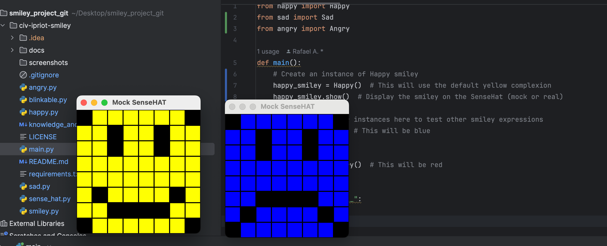
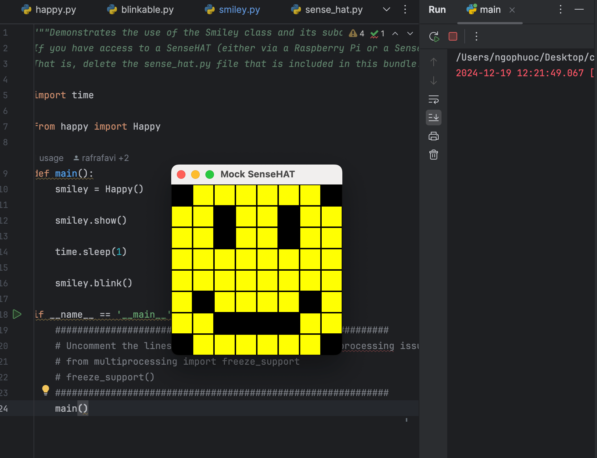
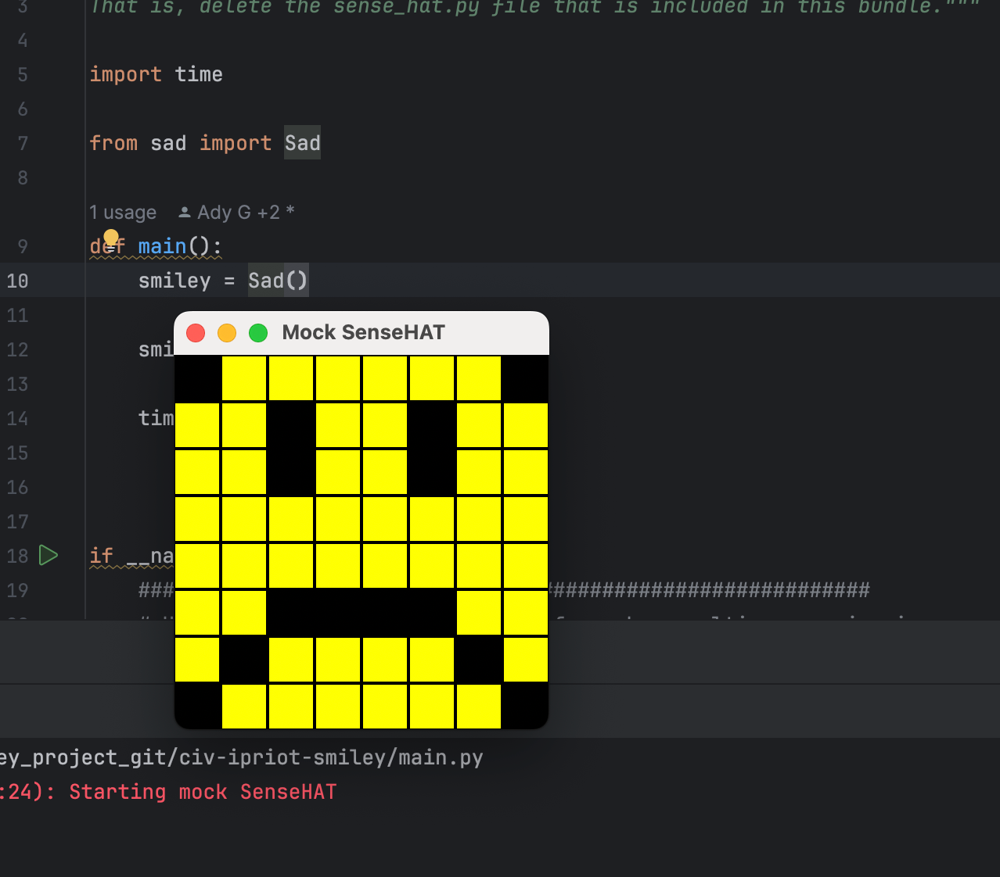
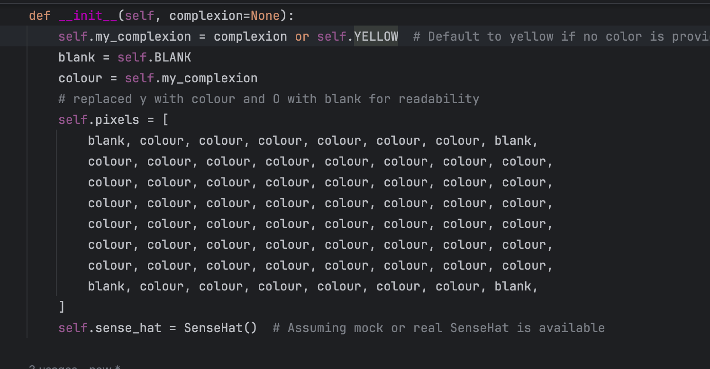

<style>

body {
    counter-reset: h2counter;
}

/* H1 - No numbering */
h1 {
    /* No counter reset or increment */
}

/* H2 - Level 1 numbering */
h2 {
    counter-reset: h3counter;
}

h2::before {
    counter-increment: h2counter;
    content: counter(h2counter) ". ";
}

/* H3 - Level 2 numbering */
h3 {
    counter-reset: h4counter;
}

h3::before {
    counter-increment: h3counter;
    content: counter(h2counter) "." counter(h3counter) " ";
}

/* H4 - Level 3 numbering (optional) */
h4 {
    counter-reset: h5counter;
}

h4::before {
    counter-increment: h4counter;
    content: counter(h2counter) "." counter(h3counter) "." counter(h4counter) " ";
}

</style>

# Evidence and Knowledge

This document includes instructions and knowledge questions that must be completed to receive a *Competent* grade on this portfolio task.

## Required evidence

### Answer all questions in this document

- Each answer should be complete, well-articulated, and within the specified word count limits (if added) for each question.
- Please make sure **all** external sources are properly cited.
- You must **use your own words**. Please include your full chat transcripts if you use generative AI in any way.
- Generative AI hallucinates, is not an authoritative source

### Make all the required modifications to the code

- Please follow the instructions in this document to make the changes needed to the code.

- When requested to upload evidence, upload all screenshots to `screenshots/` and embed them in this document. For example:





- You must upload the code into your GitHub repository.
- While you can use a branch, your code should be in main when you submit.
- Upload a zip of this repository to Blackboard when you are ready to submit.
- You will be notified of your result via Blackboard
- However, if using GitHub classrooms, you may also receive additional feedback on GitHub directly

### Optional: Use of Raspberry Pi and SenseHat

Raspberry Pi or SenseHat is **optional** for this activity. You can use the included `sense_hat.py` file to simulate the SenseHat on your computer.

If you use a Pi, please **delete** the `sense_hat.py` file.

### Accessible version of the code

This project relies on visual patterns that appear on an LED matrix. If you have any accessibility requirements, you can use the `udl/accessible` branch to complete the project. This branch provides an accessible code version that uses text-based patterns instead of visual ones.

Please discuss this with your lecturer before using that branch.

## Specific Tasks & Questions

Address the following tasks and questions based on the code provided in this repository.

### Set up the project locally

1. Fork this repository (if not using GitHub Classrooms)
2. Clone your repository locally
3. Run the project locally by executing the `main.py` file
4. Evidence this by providing screenshots of the project directory structure and the output of the `main.py` file



If you are running on a Raspberry Pi, you can use the following command to run the project and then screenshot the result:

```bash
ls
python3 main.py
```

### Fundamental code comprehension

 Answer each of the following questions **as they relate to that code** supplied by in this repository (ignore `sense_hat.py`):

1. Examine the code for the `smiley.py` file and provide  an example of a variable of each of the following types and their corresponding values (`_` should be replaced with the appropriate values):

   | Type                    | name           | value                            |
   | ----------              |----------------|----------------------------------|
   | built-in primitive type | blank                                    | (0, 0, 0) (a tuple representing a black color)                     |
    | built-in primitive type | colour| The value of self.my_complexion, which defaults to (255, 255, 0) (yellow) or any other color passed to the constructor|
   | built-in composite type | self.pixels    | A list of 64 pixel color tuples (like [(0,0,0), (255,255,0), ...]) representing the smiley face                            |
   | user-defined type       | self.sense_hat | an instance of the sensehat class |
     | built-in primitive type | self.my_complexion |(255, 255, 0) by default, or another color tuple if provided during initialization|

2. Fill in (`_`) the following table based on the code in `smiley.py`:

   | Object                   | Type                    |
   | ------------             |-------------------------|
   | self.pixels              | list                    |
   | A member of self.pixels  | tuple(e.g.,(255,255,0)) |
   | self                     | Smiley(instance)        |

3. Examine the code for `smiley.py`, `sad.py`, and `happy.py`. Give an example of each of the following control structures using an example from **each** of these files. Include the first line and the line range:

   | Control Flow | File      | First line                                                  | Line range |
   | ------------ |-----------|-------------------------------------------------------------|------------|
   |  sequence    | smiley.py | self.sense_hat = Sensehat()                                 | 10 -20     |
   |  selection   | happy.py  | self.pixels[pixel]=self.BLANK if wide_open else self.YELLOW | 22-23      |
   |  iteration   | sad.py    | for pixel in mouth :                                        | 15-18      |

4. Though everything in Python is an object, it is sometimes said to have four "primitive" types. Examining the three files `smiley.py`, `sad.py`, and `happy.py`, identify which of the following types are used in any of these files, and give an example of each (use an example from the code, if applicable, otherwise provide an example of your own):

   | Type                    | Used? | Example |
   | ----------------------- |-------|-|
   | int                     | yes   | pixel = 41 (pixel index in happy.py) |
   | float                   | yes   | delay = 0.25 in blink () method (happy.py) |
   | str                     | no    | Not applicable. Docstrings don't count as variable usage in this context.|
   | bool                    | yes   | dimmed = True in dim_display() method(smiley.py) |

5. Examining `smiley.py`, provide an example of a class variable and an instance variable (attribute). Explain **why** one is defined as a class variable and the other as an instance variable.

> in smiley, for exampples of class and instance variables are :
> 
> >class varibale : WHITE = (255,255,255), which are defined at the class level and shared across all circumstances of Smiley. 
> because the color white is a constant that doesn't change per smiley. 
> instance variable: self.sense_hat = senseHat()
> each smiley has its own sense_hat object to control its unique display on the sense of HAT
> 
>

6. Examine `happy.py`, and identify the constructor (initializer) for the `Happy` class:
   1. What is the purpose of a constructor (in general) and this one (in particular)?

   > in general, i suppose the purpose of a constructor who initializes a new project in parallel they set up any important attributes or set for it to function.  
   > 
   >The constructor function's name is `__init__()`
   > 
   >in happy.py, the constructor initializes the smiley face with happy expression by setting up an open eyes and a smilling mouth 

   2. What statement(s) does it execute (consider the `super` call), and what is the result?

   > constructor calls `{ supper().__init__()}` , which initializes attributes from parent Smiley and blinkable classes, setting up the led matrix and any blinking behavior. after all it runs self.draw_mouth() and self.draw_eyes(), which configure the smiley face to display a happy expression with an open mouth and eyes. 
   >

### Code style

1. What code style is used in the code? Is it likely to be the same as the code style used in the SenseHat? Give to reasons as to why/why not:
   
> with my knowledge this code style is based on the PEP8 platform, it means they're included in structure indentation, clear docstrings, and use of naming inventions with meaningful variables.  
>
> it's kind of differences between Sense Hat library.
> 
>firstly, the Sense HAT library is an official python library, likely following strictly to internal principal or optimized styles for performance and readability across multiple developers this custom code may not fully align with those standards. 
>
> finally, variation in documentation style: the sense HAT library may use more standardized and detailed docstrings(such as using the sphinx style for documentation generation), while this code has simpler, less structured docstrings that may not fully match the library's documentation practices. 


2. List three aspects of this convention you see applied in the code.

> snake case is for Variables and functions: Variable and function names use lowercase letters with underscore to separate words, adhering the [snake_case], such as draw_mouth, wide_open
>
> pascal case for class names: class names use capitalized words without underscores, following PascalCase such as Happy, Smiley, SenseHat
> 
> constants in all caps: constants like colour definitions are named in all uppercase to indicate that they shouldn't change such as WHITE, BLACK, YELLOW.


3. Give two examples of organizational documentation in the code.

> docstrings and inline comments 
> > Docstrings for classes and Methods : docstring provide description of each class and methods, they explain their purpose, parameters, and behavior( e.g., """ Draws a mouth feature on the smiley."""")
>
> > inline comments : comments within the code explain specific or clarify the purpose of certain blocks, helping to make the logic clearer  
> (# set the SenseHat's light intensity to low )

### Identifying and understanding classes

> Note: Ignore the `sense_hat.py` file when answering the questions below

1. List all the classes you identified in the project. Indicate which classes are base classes and which are subclasses. For subclasses, identify all direct base classes.
  
  Use the following table for your answers:

| Class Name | Super or Sub? | Direct parent(s)  |
|------------|---------------|-------------------|
| Smiley     | Super         | none              |
| Blinkable  | super         | none              |
| happy      | sub           | Smiley, Blinkable |
| sad        | sub           | simley            |


 

2. Explain the concept of abstraction, giving an example from the project (note "implementing an ABC" is **not** in itself an example of abstraction). (Max 150 words)

> Abstraction in python is defined as a process of handling complexity by hiding unnecessary information from the user.
>
> > the smiley class is an example of abstraction. it encapsulates the logic for creating a basic smiley face with pixel colors and patterns, which are the used as building blocks for other expressions. by providing methods like ( draw_mouth() and draw_eyes()), the Smiley class hides the complexity of drawing each pixel, making it easier for subclasses like Happy, Sad to focus on unique facial expressions without managing low level details of pixel manipulation. 
> 

3. What is the name of the process of deriving from base classes? What is its purpose in this project? (Max 150 words)

> Inheritance is the name of the process of deriving from base classes, its purpose in this projects is to enable you create 
>  new classes that reuse, extend, and modify the behavior defined in other classes. 
> 
> By inheriting from Smiley, both the Happy and Sad classes gain access to core smiley functionalities, such as setting up the pixel matrix 
>

### Compare and contrast classes

Compare and contrast the classes Happy and Sad.

1. What is the key difference between the two classes?
   >The key difference lies in the Blinkable for blinking eyes. 
   >The Happy class uses blinking but sad class doesn't
This difference affects the overall appearance of the smiley, making Happy appear blinking eyes and Sad appear static eyes.
   >
2. What are the key similarities?
   > Both inherited classes from Smiley class, they have similar methods such as draw_mouth(), draw_eyes() to set up facial expression when displaying on the LED
   > 
   >
3. What difference stands out the most to you and why?
   > The most visible difference is the mouth pattern, as this directly affects whether the smiley face looks happy or sad. this distinction is essential because it makes each class instantly recognizable for its emotional expression, highlighting the purpose of the design. 
   > 
   >
4. How does this difference affect the functionality of these classes
   > This difference changes the visual output o the show () method. for Happy, Draw_mouth()
   > displays a smiling expression, while for sad, it shows a frown. this distinction enables each class to fulfill its purpose of conveying difference emotions, enhancing user interaction by allowing the program to display expressive faces for feedback or entertainment. 
   >

### Where is the Sense(Hat) in the code?

1. Which class(es) utilize the functionality of the SenseHat?
   > The Smiley class is the primary class utilizing the functionality of the SenseHat. it initialized a SenseHat instance and gives methods to control the LED matrix display. 
   > 
   >
2. Which of these classes directly interact with the SenseHat functionalities?
   > The Smiley class is directly interactive with the SenseHat by setting up and manipulating the LED matrix display through the self.sense_hat instance. while Happy and Sad inherit display functionalities from Smiley, only Smiley directly manages the SenseHat's hardwar. 
   > 
   >
3. Discuss the hiding of the SenseHAT in terms of encapsulation (100-200 Words)
   > Encapsulation is about hiding details and only exposing what’s necessary. In this code, the SenseHat functionality is hidden inside the Smiley class. The Smiley class creates an instance of SenseHat and provides methods, like show() and dim_display(), to control it. This means that only Smiley directly interacts with the SenseHat hardware, while other classes like Happy and Sad don’t need to know the details of how the hardware works.
   > 
   > By hiding SenseHat inside Smiley, the code is simpler and safer:
   >
   > Simpler: Happy and Sad only focus on drawing faces, not hardware control.
   > 
   > Safer: If SenseHat needs changes, only Smiley needs updating.
   > 


### Sad Smileys Can’t Blink (Or Can They?)

Unlike the `Happy` smiley, the current implementation of the `Sad` smiley does not possess the ability to blink. Let's first explore how blinking has been implemented in the Happy Smiley by examining the blink() method, which takes one argument that determines the duration of the blink.

**Understanding Blink Mechanism:**

1. Does the code's author believe that every `Smiley` should be able to blink? Explain.

> No, the author doesn’t intend every smiley to blink. Since blink() is only in the Happy class, blinking seems optional and specific to certain smileys.
>

2. For those smileys that blink, does the author expect them to blink in the same way? Explain.

> Not necessarily. By defining blink() only in Happy, each smiley can have a unique blink() method if needed, allowing different blinking behaviors.
>

3. Referring to the implementation of blink in the Happy and Sad Smiley classes, give a brief explanation of what polymorphism is.

> Polymorphism allows different smileys to have methods with the same name (e.g., blink()) but with distinct behaviors. If Sad had a blink() method, it could blink differently from Happy, letting each smiley control its unique blinking style.
>

4. How is inheritance used in the blink method, and why is it important for polymorphism?

> Inheritance allows Happy to build on the Smiley base class, adding its own blink() method while keeping common smiley features. This setup enables polymorphism, as each smiley subclass can define its unique blink() behavior. Polymorphism allows objects like Happy and Sad to respond to blink() calls differently, giving each smiley individual expression while maintaining consistency in the class structure.
>
1. **Implement Blink in Sad Class:**

   - Create a new method called `blink` within the Sad class. Ensure you use the same method signature as in the Happy class:

   ```python
   def blink(self, delay=0.25):
       pass  # Replace 'pass' with your implementation
   ```

2. **Code Implementation:** Implement the code that allows the Sad smiley to blink. Use the implementation from the Happy Smiley as a reference. Ensure your new method functions similarly by controlling the blink duration through the `delay` argument.

3. **Testing the Implementation:**

- Test the new blink functionality on your Raspberry Pi or within the Python classes provided. You might need to adjust the `main.py` script to incorporate Sad Smiley's new blinking capability.

Include a screenshot of the sad smiley or the modified `main.py`:



- Observe and document the Sad smiley as it blinks its eyes. Describe any adjustments or issues encountered during implementation.

> The Sad smiley’s blink function works effectively,Minor adjustments improved functionality, including increasing the delay from 0.25 to 0.5 for clearer visibility, adding a loop in main.py for multiple blinks to observe timing, and dimming the display brightness to better distinguish between open and closed eyes.
> 
> An initial issue with the eyes not resetting after each blink was resolved by adding a brief delay between blinks.

  ### If It Walks Like a Duck…

  Previously, you implemented the blink functionality for the Sad smiley without utilizing the class `Blinkable`. Assuming you did not use `Blinkable` (even if you actually did), consider how the Sad smiley could blink similarly to the Happy smiley without this specific class.

  1. **Class Type Analysis:** What kind of class is `Blinkable`? Inspect its superclass for clues about its classification.

  > The Blinkable class is an abstract class or interface, providing a blueprint for blinking functionality without concrete implementation.
     

  2. **Class Implementation:** `Blinkable` is a class intended to be implemented by other classes. What generic term describes this kind of class, which is designed for implementation by others? **Clue**: Notice the lack of any concrete implementation and the naming convention.

  > Blinkable is a mixin class, designed to be inherited by other classes to add specific functionality, like blinking.

  3. **OO Principle Identification:** Regarding your answer to question (2), which Object-Oriented (OO) principle does this represent? Choose from the following and justify your answer in 1-2 sentences: Abstraction, Polymorphism, Inheritance, Encapsulation.

  > The principle is Abstraction, as Blinkable defines the general concept of blinking without specifying the details, allowing other classes to implement it.

  4. **Implementation Flexibility:** Explain why you could grant the Sad Smiley a blinking feature similar to the Happy Smiley's implementation, even without directly using `Blinkable`.

  > You could grant the Sad Smiley a blinking feature similar to the Happy Smiley's by simply adding a blink() method to the Sad class. This would allow Sad to blink without needing to directly inherit from the Blinkable class. By implementing the method directly within the class, the Sad smiley could still exhibit the same behavior (blinking) without relying on a specific base class.


  5. **Concept and Language Specificity:** In relation to your response to question (4), what is this capability known as, and why is it feasible in Python and many other dynamically typed languages but not in most statically typed programming languages like C#? **Clue** This concept is hinted at in the title of this section.

  > This capability is known as Duck Typing. In Python and other dynamically typed languages, objects are considered to be of a certain type based on their methods and behavior rather than their declared class. This makes it easy to add functionality like blinking by simply defining the required method, regardless of inheritance. In contrast, statically typed languages like C# enforce strict type hierarchies, meaning you must explicitly declare inheritance or implement interfaces to achieve similar functionality.

  ***

  ## Refactoring

  ### Does a Smiley Have to Be Yellow?

  While our current implementation predominantly features yellow smileys, emotional expressions like sickness or anger typically utilize colors like green, red, or orange. We'll explore the feasibility of integrating these colors into our smileys.

  1. **Defined Colors and Their Location:**

     1. Which colors are defined and in which class(s)?
        >  WHITE(255,255,255); GREEN(0,255,0); RED(255,0,0); YELLOW(255,255,0), BLANK(0,0,0)
     2. What type of variables hold these colors? Are the values expected to change during the program's execution? Explain your answer.
        >  The colors are stored as class constants (e.g., WHITE, GREEN), which are assigned as tuples of RGB values. These variables are not expected to change during execution because they are defined as class constants (upper case naming convention) and represent fixed color values throughout the program.
     3. Add the color blue to the appropriate class using the appropriate format and values.
        >  BLUE = (0, 0, 255)

  2. **Usage of Color Variables:**

     1. In which classes are the color variables used?
        > Color variables are used in the Smiley class for rendering the pixels on the display. The colors like YELLOW and BLANK are applied in methods like draw_eyes() and draw_mouth() to set the pixel colors for different facial features. They may also be used in subclasses like Sad or Happy to customize the expressions.

  3. **Simple Method to Change Colors:**
  4. What is the easiest way you can think to change the smileys to green? Easiest, not necessarily the best!
     > self.pixels = [
    O, GREEN, GREEN, GREEN, GREEN, GREEN, GREEN, O,
    GREEN, GREEN, GREEN, GREEN, GREEN, GREEN, GREEN, GREEN,
    GREEN, GREEN, GREEN, GREEN, GREEN, GREEN, GREEN, GREEN,
    GREEN, GREEN, GREEN, GREEN, GREEN, GREEN, GREEN, GREEN,
    GREEN, GREEN, GREEN, GREEN, GREEN, GREEN, GREEN, GREEN,
    GREEN, GREEN, GREEN, GREEN, GREEN, GREEN, GREEN, GREEN,
    O, GREEN, GREEN, GREEN, GREEN, GREEN, GREEN, O,
]


  Here's a revised version of the "Flexible Colors – Step 1" section for the smiley project, incorporating your specifications for formatting and content updates:

  ### Flexible Colors – Step 1

  Changing the color of the smileys once is straightforward, but it isn't very flexible. To facilitate various colors for smileys, it is advisable not to hardcode values in any class. This approach was identified earlier as a necessary change. Let's start by removing the built-in assumptions about color in our classes.

  1. **Add a method called `complexion` to the `Smiley` class:** Implement this instance method to return `self.YELLOW`. Using the term "complexion" instead of "color" provides a more abstract terminology that focuses on the meaning rather than implementation.

  2. **Refactor subclasses to use the `complexion` method:** Modify any subclass that directly accesses the color variable to instead utilize the new `complexion` method. This ensures that color handling is centralized and can be easily modified in the future.

  3. **Determine the applicable Object-Oriented principle:** Consider whether Abstraction, Polymorphism, Inheritance, or Encapsulation best applies to the modifications made in this step.

  4. **Verify the implementation:** Ensure that the modifications function as expected. The smileys should still display in yellow, confirming that the new method correctly replaces the direct color references.

  This step is crucial for setting up a more flexible system for color management in the smiley display logic, allowing for easy adjustments and extensions in the future.

  ### Flexible Colors – Step 2

  Having removed the hardcoded color values, we now enhance the base class to support dynamic color assignments more effectively.

  1. **Modify the `__init__()` method in the `Smiley` class:** Introduce a default argument named `complexion` and assign `YELLOW` as its default value. This allows the instantiation of smileys with customizable colors.

  2. **Introduce a new instance variable:** Create a variable called `my_complexion` and assign the `complexion` parameter to it. This step ensures that each smiley instance can maintain its own color state.

  3. **Rationale for `my_complexion`:** Using a distinct instance variable like `my_complexion` avoids potential conflicts with the method parameter names and clarifies that it is an attribute specific to the object.

  4. **Bulk rename:** We want to update our grid to use the value of complexion, but we have so many `Y`'s in the grid. Use your IDE's refactoring tool to rename all instances of the **symbol** `Y` to `X`. Where `X` is the value of the `complexion` variable. Include a screenshot evidencing you have found the correct refactor tool and the changes made.

  

  5. **Update the `complexion` method:** Adjust this method to return `self.my_complexion`, ensuring that whatever color is assigned during instantiation is what the smiley displays.

  6. **Verification:** Run the updated code to confirm that Smileys still defaults to yellow unless specified otherwise.

  ### Flexible Colors – Step 3

  With the foundational changes in place, it's now possible to implement varied smiley colors for different emotional expressions.

  1. **Adjust the `Sad` class initialization:** In the `Sad` class's initializer method, change the superclass call to include the `complexion` argument with the value `self.BLUE`, as shown:

     ```python
     super().__init__(complexion=self.BLUE)
     ```

  2. **Test color functionality for the Sad smiley:** Execute the program to verify that the Sad smiley now appears blue.

  3. **Ensure the Happy smiley remains yellow:** Confirm that changes to the Sad smiley do not affect the default color of the Happy smiley, which should still display in yellow.

  4. **Design and Implement An Angry Smiley:** Create an Angry smiley class that inherits from the `Smiley` class. Set the color of the Angry smiley to red by passing `self.RED` as the `complexion` argument in the superclass call.

  ***
