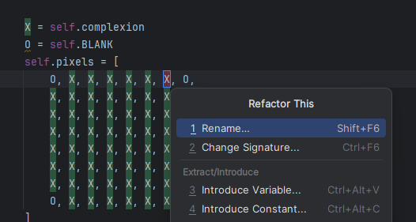

# Evidence and Knowledge

This document includes instructions and knowledge questions that must be completed to receive a *Competent* grade on this portfolio task.

## 1. Required evidence

### 1.1. Answer all questions in this document

- Each answer should be complete, well-articulated, and within the specified word count limits (if added) for each question.
- Please make sure **all** external sources are properly cited.
- You must **use your own words**. Please include your full chat transcripts if you use generative AI in any way.
- Generative AI hallucinates, is not an authoritative source

### 1.2. Make all the required modifications to the code

- Please follow the instructions in this document to make the changes needed to the code.

- When requested to upload evidence, upload all screenshots to `screenshots/` and embed them in this document. For example:

```markdown

```


> Note the `!`, and the use of a relative path.

- You must upload the code into your GitHub repository.
- While you can use a branch, your code should be in main when you submit.
- Upload a zip of this repository to Blackboard when you are ready to submit.
- You will be notified of your result via Blackboard
- However, if using GitHub classrooms, you may also receive additional feedback on GitHub directly

### 1.3. Optional: Use of Raspberry Pi and SenseHat

Raspberry Pi or SenseHat is **optional** for this activity. You can use the included `sense_hat.py` file to simulate the SenseHat on your computer.

If you use a Pi, please **delete** the `sense_hat.py` file.

### 1.4. Accessible version of the code

This project relies on visual patterns that appear on an LED matrix. If you have any accessibility requirements, you can use the `udl/accessible` branch to complete the project. This branch provides an accessible code version that uses text-based patterns instead of visual ones.

Please discuss this with your lecturer before using that branch.

## 2. Specific Tasks & Questions

Address the following tasks and questions based on the code provided in this repository.

### 2.1. Set up the project locally

1. Fork this repository (if not using GitHub Classrooms)
2. Clone your repository locally
3. Run the project locally by executing the `main.py` file
4. Evidence this by providing screenshots of the project directory structure and the output of the `main.py` file


If you are running on a Raspberry Pi, you can use the following command to run the project and then screenshot the result:

```bash
ls
python3 main.py
```

### 2.2. Fundamental code comprehension

 Answer each of the following questions **as they relate to that code** supplied by in this repository (ignore `sense_hat.py`):

1. Examine the code for the `smiley.py` file and provide  an example of a variable of each of the following types and their corresponding values (`_` should be replaced with the appropriate values):

   | Type                    | name               | value           |
   |-------------------------|--------------------|-----------------|
   | built-in primitive type | (bool) dimmed      | True            |
   | built-in composite type | (tuple) BLANK      | (0, 0, 0)       |
   | user-defined type       | (list) self.pixels | the list of Y’s |

2. Fill in (`_`) the following table based on the code in `smiley.py`:

   | Object                  | Type   |
   |-------------------------|--------|
   | self.pixels             | list   |
   | A member of self.pixels | int    |
   | self                    | Smiley |

3. Examine the code for `smiley.py`, `sad.py`, and `happy.py`. Give an example of each of the following control structures using an example from **each** of these files. Include the first line and the line range:

   | Control Flow | File      | First line              | Line range |
   |--------------|-----------|-------------------------|-----------|
   | sequence     | smiley.py | WHITE = (255, 255, 255) | lines 5-9 |
   | selection    | sad.py    | if wide_open:           | lines 25-29 |
   | iteration    | happy.py  | for pixel in eyes:      | lines 30-31 |

4. Though everything in Python is an object, it is sometimes said to have four "primitive" types. Examining the three files `smiley.py`, `sad.py`, and `happy.py`, identify which of the following types are used in any of these files, and give an example of each (use an example from the code, if applicable, otherwise provide an example of your own):

   | Type  | Used?          | Example                                               |
   |-------|----------------|-------------------------------------------------------|
   | int   | in happy.py	   | eyes = [10, 13, 18, 21] is a list containing integers |
   | float | in happy.py    | delay=0.25 where delay is assigned a float            |
   | str   | not applicable | ”example string”                                      |
   | bool  | in happy.py    | wide_open=True where wide_open is assigned a bool     |

5. Examining `smiley.py`, provide an example of a class variable and an instance variable (attribute). Explain **why** one is defined as a class variable and the other as an instance variable.

> The colours (WHITE, GREEN, etc) are class variables because it’s created in the class and shared among instances, such as self.sense_hat = SenseHat(). This instance is created inside the initializer and is specific to each object.

6. Examine `happy.py`, and identify the constructor (initializer) for the `Happy` class:
   1. What is the purpose of a constructor (in general) and this one (in particular)?

   > The initializer is __init__(self): and it is to create a new object from a class. This one in particular uses super().__init__() to initialize from the parent class (Smiley).

   2. What statement(s) does it execute (consider the `super` call), and what is the result?

   > It executes by making the parent (Smiley) blink

### 2.3. Code style

1. What code style is used in the code? Is it likely to be the same as the code style used in the SenseHat? Give to reasons as to why/why not:

> The code style uses PEP8 as it implements the correct strategies such as the usage of single whitespaces after commas, single whitespaces on each side of the variable assignment operator, use of 4 spaces per indentation level. etc. It is likely to be the same code style as SenseHat because it implements the same PEP8 strategies.

2. List three aspects of this convention you see applied in the code.

> The PEP8 conventions applied in the code is naming variable and functions named with snake_case or camelCase, imports located at the top of code, the use of helpful comments and docstrings.

3. Give two examples of organizational documentation in the code.

> In main.py file, the lines 1-3 documents the instruction to delete the sense.hat.py file if you already have a SenseHAT emulator. The code also includes a LICENSE document on usage and distribution of the program.

### 2.4. Identifying and understanding classes

> Note: Ignore the `sense_hat.py` file when answering the questions below

1. List all the classes you identified in the project. Indicate which classes are base classes and which are subclasses. For subclasses, identify all direct base classes.
  
  Use the following table for your answers:

| Class Name | Super or Sub? | Direct parent(s)     |
|-----------|---------------|----------------------|
| NotReal   | Sub           | NotRealParent        |
| Smiley    | Superclass    | Parent               |
| Sad       | Subclass      | Smiley               |
| Happy     | Subclass      | Smiley and Blinkable |
| Blinkable | Subclass      | ABC                  |


2. Explain the concept of abstraction, giving an example from the project (note "implementing an ABC" is **not** in itself an example of abstraction). (Max 150 words)

> Abstraction is to hide complexity and showing only the necessary details. For example, in main.py the main() function calls smiley.show() to display the smiley on the screen without revealing how it’s actually done.

3. What is the name of the process of deriving from base classes? What is its purpose in this project? (Max 150 words)

> Inheritance is the process of deriving from a base class. The purpose of using it in this project is to reduce repetitive code when creating a smiley face with different expressions. 
> When inheritance is used, the different emotions can inherit from the smiley base’s attributes such as the head and colour and the focus of subclass can be on the different eyes and mouth to change the expressions.

### 2.5. Compare and contrast classes

Compare and contrast the classes Happy and Sad.

1. What is the key difference between the two classes?
   > The Happy class inherits Blinkable and can blink where as the Sad class does not, and cannot blink. 
   >
2. What are the key similarities?
   > The Happy and Sad classes both inherit from the Smiley base class. They both have draw_mouth and draw_eyes methods.
3. What difference stands out the most to you and why?
   > The difference that stands out the most is the sad class not being able to blink and how the sad and happy mouth are drawn differently by making different pixels become blank.
4. How does this difference affect the functionality of these classes
   > The difference affects the functionality of these classes because only Happy can blink and Sad remains simple with no blinks. 
   > Happy would show a smiling mouth where as the Sad should show a frowning mouth.

### 2.6. Where is the Sense(Hat) in the code?

1. Which class(es) utilize the functionality of the SenseHat?
   > The Smiley, Happy and Sad classes utilizes the functionality of the SenseHat because the Smiley holds the attribute to use the SenseHat. The Happy and Sad then inherits that attribute from the Smiley class.
2. Which of these classes directly interact with the SenseHat functionalities?
   > The base Smiley class interacts with the functionality of the SenseHat directly by initializing it.
3. Discuss the hiding of the SenseHAT in terms of encapsulation (100-200 Words)
   > The hiding of the SenseHat is done by encapsulation in the Smiley class. 
   > This happens by creating the SenseHat() object only inside the Smiley class and not passing it around. 
   > This then restricts other classes like Happy and Sad from seeing or accessing the SenseHat directly. 
   > Instead, through inheritance, they can call Smiley’s methods like .show() or .dim_display() which handle the SenseHat for them. 
   > This helps because it keeps the code more modular, clean, and easier to work with. Therefore, if something breaks with the display because of the SenseHat, 
   > we only need to fix it in one place, the Smiley class, instead of fixing it everywhere it’s used.

### 2.7. Sad Smileys Can’t Blink (Or Can They?)

Unlike the `Happy` smiley, the current implementation of the `Sad` smiley does not possess the ability to blink. Let's first explore how blinking has been implemented in the Happy Smiley by examining the blink() method, which takes one argument that determines the duration of the blink.

**Understanding Blink Mechanism:**

1. Does the code's author believe that every `Smiley` should be able to blink? Explain.

> No because they could have made the parent class (Smiley) have the blink attribute for all Smiley’s created, but didn’t. Instead, it’s made so that only some smileys (Happy) can blink from the inherited Blinkable class.

2. For those smileys that blink, does the author expect them to blink in the same way? Explain.

> The author does not expect them to blink in the same way because they set a parameter to accept different blinking times instead of setting one blink time in the function.

3. Referring to the implementation of blink in the Happy and Sad Smiley classes, give a brief explanation of what polymorphism is.

> Polymorphism means different classes can have the same function name but do different things. For example, only Happy has a blink() function with the delay time. If we make a different smiley with its own blink style, we can still use the same name, blink() with a different delay time. Therefore, the same function can be used to create different blink styles.

4. How is inheritance used in the blink method, and why is it important for polymorphism?

> Inheritance is used to allow the Happy class to inherit from Smiley and access Blinkable. The Happy class can then write it’s own version of blink() by having a different delay amount. Therefore, polymorphism occurs due to the occurrence of different classes having the same method name (like blink) but doing it in their own way.
>
1. **Implement Blink in Sad Class:**

   - Create a new method called `blink` within the Sad class. Ensure you use the same method signature as in the Happy class:

   ```python
   def blink(self, delay=0.25):
       pass  # Replace 'pass' with your implementation
   ```

2. **Code Implementation:** Implement the code that allows the Sad smiley to blink. Use the implementation from the Happy Smiley as a reference. Ensure your new method functions similarly by controlling the blink duration through the `delay` argument.

3. **Testing the Implementation:**

- Test the new blink functionality on your Raspberry Pi or within the Python classes provided. You might need to adjust the `main.py` script to incorporate Sad Smiley's new blinking capability.

Include a screenshot of the sad smiley or the modified `main.py`:


- Observe and document the Sad smiley as it blinks its eyes. Describe any adjustments or issues encountered during implementation.

  > The Sad smiley’s blink was implemented by adding the blink method, importing time, importing Blinkable, and setting Blinkable as parameter in the Sad class. Then setting smiley to be Sad(). The result was a longer pause before the eyes open again due to the blink delay being adjusted longer to 2 seconds.

  ### 2.8. If It Walks Like a Duck…

  Previously, you implemented the blink functionality for the Sad smiley without utilizing the class `Blinkable`. Assuming you did not use `Blinkable` (even if you actually did), consider how the Sad smiley could blink similarly to the Happy smiley without this specific class.

  1. **Class Type Analysis:** What kind of class is `Blinkable`? Inspect its superclass for clues about its classification.

     > Blinkable is an abstract base class inherited from the ABC module.

  2. **Class Implementation:** `Blinkable` is a class intended to be implemented by other classes. What generic term describes this kind of class, which is designed for implementation by others? **Clue**: Notice the lack of any concrete implementation and the naming convention.

  > You can describe Blinkable as a base class which is designed to be implemented by others. 

  3. **OO Principle Identification:** Regarding your answer to question (2), which Object-Oriented (OO) principle does this represent? Choose from the following and justify your answer in 1-2 sentences: Abstraction, Polymorphism, Inheritance, Encapsulation.

  > This OO principle represents abstraction as it hides the details of how blinking works and only says what it should do. The subclasses will then decide how blinking is done, such as with different blink delays for each smiley.

  4. **Implementation Flexibility:** Explain why you could grant the Sad Smiley a blinking feature similar to the Happy Smiley's implementation, even without directly using `Blinkable`.

  > Sad was able to have a blinking feature just by having it’s version of blink(). It didn’t need to use Blinkable because Happy class has the method and Sad just had to use that method for it to work.

  5. **Concept and Language Specificity:** In relation to your response to question (4), what is this capability known as, and why is it feasible in Python and many other dynamically typed languages but not in most statically typed programming languages like C#? **Clue** This concept is hinted at in the title of this section.

  > The capability is known as duck typing where it only cares for the methods that’s being used and not what type it is. Therefore, as long as it is used, it will run.

  ***

  ## 3. Refactoring

  ### 3.1. Does a Smiley Have to Be Yellow?

  While our current implementation predominantly features yellow smileys, emotional expressions like sickness or anger typically utilize colors like green, red, or orange. We'll explore the feasibility of integrating these colors into our smileys.

  1. **Defined Colors and Their Location:**

     1. Which colors are defined and in which class(s)?
        > The colours white, green, red, yellow and blank are defined in the Smiley class
     2. What type of variables hold these colors? Are the values expected to change during the program's execution? Explain your answer.
        > Class variables hold these colours and the values are not expected to change as they are tuples.
     3. Add the color blue to the appropriate class using the appropriate format and values.

  2. **Usage of Color Variables:**

     1. In which classes are the color variables used?
        > The colour variables are used in the classes Smiley, Happy and Sad

  3. **Simple Method to Change Colors:**
  4. What is the easiest way you can think to change the smileys to green? Easiest, not necessarily the best!
     > On line 15 in smiley.py we can change the Y = self.YELLOW colour to GREEN

  Here's a revised version of the "Flexible Colors – Step 1" section for the smiley project, incorporating your specifications for formatting and content updates:

  ### 3.2. Flexible Colors – Step 1

  Changing the color of the smileys once is straightforward, but it isn't very flexible. To facilitate various colors for smileys, it is advisable not to hardcode values in any class. This approach was identified earlier as a necessary change. Let's start by removing the built-in assumptions about color in our classes.

  1. **Add a method called `complexion` to the `Smiley` class:** Implement this instance method to return `self.YELLOW`. Using the term "complexion" instead of "color" provides a more abstract terminology that focuses on the meaning rather than implementation.

  2. **Refactor subclasses to use the `complexion` method:** Modify any subclass that directly accesses the color variable to instead utilize the new `complexion` method. This ensures that color handling is centralized and can be easily modified in the future.

  3. **Determine the applicable Object-Oriented principle:** Consider whether Abstraction, Polymorphism, Inheritance, or Encapsulation best applies to the modifications made in this step.

  4. **Verify the implementation:** Ensure that the modifications function as expected. The smileys should still display in yellow, confirming that the new method correctly replaces the direct color references.

  This step is crucial for setting up a more flexible system for color management in the smiley display logic, allowing for easy adjustments and extensions in the future.

  ### 3.3. Flexible Colors – Step 2

  Having removed the hardcoded color values, we now enhance the base class to support dynamic color assignments more effectively.

  1. **Modify the `__init__()` method in the `Smiley` class:** Introduce a default argument named `complexion` and assign `YELLOW` as its default value. This allows the instantiation of smileys with customizable colors.

  2. **Introduce a new instance variable:** Create a variable called `my_complexion` and assign the `complexion` parameter to it. This step ensures that each smiley instance can maintain its own color state.

  3. **Rationale for `my_complexion`:** Using a distinct instance variable like `my_complexion` avoids potential conflicts with the method parameter names and clarifies that it is an attribute specific to the object.

  4. **Bulk rename:** We want to update our grid to use the value of complexion, but we have so many `Y`'s in the grid. Use your IDE's refactoring tool to rename all instances of the **symbol** `Y` to `X`. Where `X` is the value of the `complexion` variable. Include a screenshot evidencing you have found the correct refactor tool and the changes made.

  

  5. **Update the `complexion` method:** Adjust this method to return `self.my_complexion`, ensuring that whatever color is assigned during instantiation is what the smiley displays.

  6. **Verification:** Run the updated code to confirm that Smileys still defaults to yellow unless specified otherwise.

  ### 3.4. Flexible Colors – Step 3

  With the foundational changes in place, it's now possible to implement varied smiley colors for different emotional expressions.

  1. **Adjust the `Sad` class initialization:** In the `Sad` class's initializer method, change the superclass call to include the `complexion` argument with the value `self.BLUE`, as shown:

     ```python
     super().__init__(complexion=self.BLUE)
     ```

  2. **Test color functionality for the Sad smiley:** Execute the program to verify that the Sad smiley now appears blue.

  3. **Ensure the Happy smiley remains yellow:** Confirm that changes to the Sad smiley do not affect the default color of the Happy smiley, which should still display in yellow.

  4. **Design and Implement An Angry Smiley:** Create an Angry smiley class that inherits from the `Smiley` class. Set the color of the Angry smiley to red by passing `self.RED` as the `complexion` argument in the superclass call.

  ***
