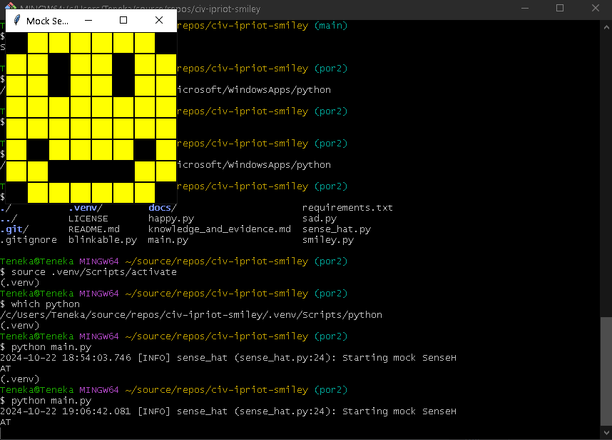
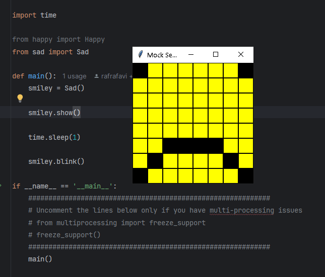
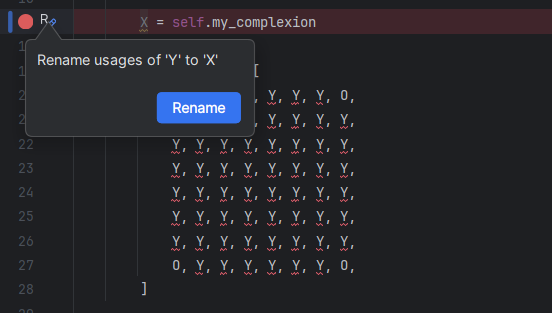
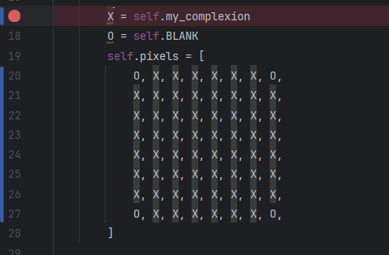

<style>

body {
    counter-reset: h2counter;
}

/* H1 - No numbering */
h1 {
    /* No counter reset or increment */
}

/* H2 - Level 1 numbering */
h2 {
    counter-reset: h3counter;
}

h2::before {
    counter-increment: h2counter;
    content: counter(h2counter) ". ";
}

/* H3 - Level 2 numbering */
h3 {
    counter-reset: h4counter;
}

h3::before {
    counter-increment: h3counter;
    content: counter(h2counter) "." counter(h3counter) " ";
}

/* H4 - Level 3 numbering (optional) */
h4 {
    counter-reset: h5counter;
}

h4::before {
    counter-increment: h4counter;
    content: counter(h2counter) "." counter(h3counter) "." counter(h4counter) " ";
}

</style>

# Evidence and Knowledge

This document includes instructions and knowledge questions that must be completed to receive a *Competent* grade on this portfolio task.

## Required evidence

### Answer all questions in this document

- Each answer should be complete, well-articulated, and within the specified word count limits (if added) for each question.
- Please make sure **all** external sources are properly cited.
- You must **use your own words**. Please include your full chat transcripts if you use generative AI in any way.
- Generative AI hallucinates, is not an authoritative source

### Make all the required modifications to the code

- Please follow the instructions in this document to make the changes needed to the code.

- When requested to upload evidence, upload all screenshots to `screenshots/` and embed them in this document. For example:

```markdown

```

- You must upload the code into your GitHub repository.
- While you can use a branch, your code should be in main when you submit.
- Upload a zip of this repository to Blackboard when you are ready to submit.
- You will be notified of your result via Blackboard
- However, if using GitHub classrooms, you may also receive additional feedback on GitHub directly

### Optional: Use of Raspberry Pi and SenseHat

Raspberry Pi or SenseHat is **optional** for this activity. You can use the included `sense_hat.py` file to simulate the SenseHat on your computer.

If you use a Pi, please **delete** the `sense_hat.py` file.

### Accessible version of the code

This project relies on visual patterns that appear on an LED matrix. If you have any accessibility requirements, you can use the `udl/accessible` branch to complete the project. This branch provides an accessible code version that uses text-based patterns instead of visual ones.

Please discuss this with your lecturer before using that branch.

## Specific Tasks & Questions

Address the following tasks and questions based on the code provided in this repository.

### Set up the project locally

1. Fork this repository (if not using GitHub Classrooms)
2. Clone your repository locally
3. Run the project locally by executing the `main.py` file
4. Evidence this by providing screenshots of the project directory structure and the output of the `main.py` file



If you are running on a Raspberry Pi, you can use the following command to run the project and then screenshot the result:

```bash
ls
python3 main.py
```

### Fundamental code comprehension

 Answer each of the following questions **as they relate to that code** supplied by in this repository (ignore `sense_hat.py`):

1. Examine the code for the `smiley.py` file and provide  an example of a variable of each of the following types and their corresponding values (`_` should be replaced with the appropriate values):

   | Type                    | name                 | value                               |
   | ----------              |----------------------|-------------------------------------|
   | built-in primitive type | self.pixels (string) | first line - O, Y, Y, Y, Y, Y, Y, O |
   | built-in composite type | WHITE (tuple)        | (255, 255, 255)                     |
   | user-defined type       | Smiley (class)       | Class definiition                   |

2. Fill in (`_`) the following table based on the code in `smiley.py`:

   | Object                   | Type   |
   | ------------             |--------|
   | self.pixels              | list   |
   | A member of self.pixels  | string |
   | self                     | object |

3. Examine the code for `smiley.py`, `sad.py`, and `happy.py`. Give an example of each of the following control structures using an example from **each** of these files. Include the first line and the line range:

   | Control Flow | File     | First line | Line range |
   | ------------ |----------| ---------- |------------|
   |  sequence    | happy.py | super().__init__()         | 11-14      |
   |  selection   | happy.py | self.pixels[pixel] = self.BLANK if wide_open else self.YELLOW          | 31-31      |
   |  iteration   | sad.py   | for pixel in mouth:           | 16-17      |

4. Though everything in Python is an object, it is sometimes said to have four "primitive" types. Examining the three files `smiley.py`, `sad.py`, and `happy.py`, identify which of the following types are used in any of these files, and give an example of each (use an example from the code, if applicable, otherwise provide an example of your own):

   | Type                    | Used? | Example                                             |
   | ----------------------- |-------|-----------------------------------------------------|
   | int                     | yes   | mouth = [41, 46, 50, 51, 52, 53]                    |
   | float                   | yes   | def blink(self, delay=0.25):                        |
   | str                     | yes   | self.pixels = [O, Y, Y, Y, Y, Y, Y, O,] |
   | bool                    | yes   | def draw_eyes(self, wide_open=True)             |

5. Examining `smiley.py`, provide an example of a class variable and an instance variable (attribute). Explain **why** one is defined as a class variable and the other as an instance variable.

> A Class variable would be WHITE = (255, 255, 255) and a instance variable would be self.pixels = [O, Y, Y, Y, Y, Y, Y, O,. The class variable is used to define values that would be the same across all instances of the class - I.E white will always be white, but the pixels could be different across different instances of the class.  
>

6. Examine `happy.py`, and identify the constructor (initializer) for the `Happy` class:
   1. What is the purpose of a constructor (in general) and this one (in particular)?

   > The __init__ method is the constructor. The purpose of this is to define two methods to draw the mouth and draw the eyes, which modifies the pixel list inherited from Smiley to create the 'happy' expression. 
   >

   2. What statement(s) does it execute (consider the `super` call), and what is the result?

   > This will create new instance of a SenseHat, with yellow and blank pixels on an 8x8 grid as set in the Smiley __init__, then will use the methods in happy to change the colour of certain pixels to define the mouth and eyes.  
   >

### Code style

1. What code style is used in the code? Is it likely to be the same as the code style used in the SenseHat? Give to reasons as to why/why not:
   
> The code style is PEP8, this is likely to be the same style used in SenseHat as we can see a few examples in Smiley.py such as Camel case being used on the Class 'SenseHat' and lowercasse seperated by an underscore used in method 'set_pixels'.
>

2. List three aspects of this convention you see applied in the code.

> Constants are capitalised
> Indentation is set to 4 spaces, or one tab
> Imports, where more than one are used per file, are correctly set on separate lines  

3. Give two examples of organizational documentation in the code.

> Comments such as # We have encapsulated the SenseHat object
> Doc strings such as """
        Set the SenseHat's light intensity to low (True) or high (False)
        :param dimmed: Dim the display if True, otherwise don't dim
        """

### Identifying and understanding classes

> Note: Ignore the `sense_hat.py` file when answering the questions below

1. List all the classes you identified in the project. Indicate which classes are base classes and which are subclasses. For subclasses, identify all direct base classes.
  
  Use the following table for your answers:

| Class Name | Super or Sub? | Direct parent(s)  |
|------------|---------------|-------------------|
| Smiley     | Super         | ...               |
| Happy      | Sub           | Smiley, Blinkable |
| Sad     | Sub           | Smiley            |
| Blinkable     | Super         | ...               |

2. Explain the concept of abstraction, giving an example from the project (note "implementing an ABC" is **not** in itself an example of abstraction). (Max 150 words)

> def blink is abstract, it is left to define at the child classes. 
>

3. What is the name of the process of deriving from base classes? What is its purpose in this project? (Max 150 words)

> Inheritance. its purpose is code reuse - i.e inherits the basic shape of the smiley so we do not have to code this each time and helps maintain code organisation. 
>

### Compare and contrast classes

Compare and contrast the classes Happy and Sad. 

1. What is the key difference between the two classes?
   > Happy inherits from Smiley and Blinkable. Sad only inherits from Smiley. Sad currently does not have a 'blink' method. Different pixels are defined to be blank for the happy and sad mouth in each class. 
   >
2. What are the key similarities?
   > They both inherit from Smiley. They both use the draw_mouth and draw_eye method. The draw_eye method blanks out the same 'pixels'.
   >
3. What difference stands out the most to you and why?
   > Happy having the method to blink, and sad not -lack of inheritance from Blinkable. 
   >
4. How does this difference affect the functionality of these classes
   > The Happy class will have access to the blink method and run that code, where as the sad one will not. 
   >

### Where is the Sense(Hat) in the code?

1. Which class(es) utilize the functionality of the SenseHat?
   > Smiley
   >
2. Which of the SenseHat's functionalities does it ultilise?
   > self.sense_hat = SenseHat()
   > self.sense_hat.low_light = dimmed
   > self.sense_hat.set_pixels(self.pixels)
   >
3. Discuss the hiding of the SenseHAT in terms of encapsulation (100-200 Words)
   > Encapsulation is a core principle of object of object-oriented programming. It describes the idea of wrapping data and methods that operate on the data within a single object, called a class. In the context of the SenseHat encapsulation can be applied to restrict direct access to variables and methods which can prevent accidental modification of the data. This provides a controlled interface for interacting with the objects data and methods and only the ones we need to run the Smiley code. By encapsulating the SenseHat we can improve code organisation by creating a clear interface to separate the SenseHat class and avoid accidental changes to the SenseHat class. Encapsulation can limit access to SenseHat and prevent unauthorized modifications.  
   >

### Sad Smileys Can’t Blink (Or Can They?)

Unlike the `Happy` smiley, the current implementation of the `Sad` smiley does not possess the ability to blink. Let's first explore how blinking has been implemented in the Happy Smiley by examining the blink() method, which takes one argument that determines the duration of the blink.

**Understanding Blink Mechanism:**

1. Does the code's author believe that every `Smiley` should be able to blink? Explain.

> I believe the author does believe all Smiley should be able to blink because they have included a 'blinkable' class rather than add this functionality directly to either the happy or sad classes. 
>

2. For those smileys that blink, does the author expect them to blink in the same way? Explain.

> No, he has created an abstract method that is not defined within blinkable, therefore could be different for different smileys as it is imported into their classes.  
>

3. Referring to the implementation of blink in the Happy and Sad Smiley classes, give a brief explanation of what polymorphism is.

> Polymorphism is another core concept in object-orientated programming that allows objects of different classes to be treated as if the were objects of a common superclass. This means they can respond to the same method call in different ways depending on their specific implementation. They allow for flexibility and increased maintainability in code by using a single interface to represent different forms. In the case of the Happy and Sad smiley classes, 'draw_mouth' can be different in each class after tha main pixels shapes are defined in the smiley class.  
>

4. How is inheritance used in the blink method, and why is it important for polymorphism?

> The Sad and Happy classes inherit from the common Blinkable class which defines a blink method. They can then amend this method to implement specific blinking behaviours should we wish to implement different 'blinks' for each of the classes. polymorphism is important to establish a relationship between the classes and allowing for the specialisation of the subclasses.   
>
1. **Implement Blink in Sad Class:**

   - Create a new method called `blink` within the Sad class. Ensure you use the same method signature as in the Happy class:

   ```python
   def blink(self, delay=0.25):
       pass  # Replace 'pass' with your implementation
   ```

2. **Code Implementation:** Implement the code that allows the Sad smiley to blink. Use the implementation from the Happy Smiley as a reference. Ensure your new method functions similarly by controlling the blink duration through the `delay` argument.

3. **Testing the Implementation:**

- Test the new blink functionality on your Raspberry Pi or within the Python classes provided. You might need to adjust the `main.py` script to incorporate Sad Smiley's new blinking capability.

Include a screenshot of the sad smiley or the modified `main.py`:



- Observe and document the Sad smiley as it blinks its eyes. Describe any adjustments or issues encountered during implementation.

  > Sad smiley blinks in the same fashion as happy smiley. 

  ### If It Walks Like a Duck…

  Previously, you implemented the blink functionality for the Sad smiley without utilizing the class `Blinkable`. Assuming you did not use `Blinkable` (even if you actually did), consider how the Sad smiley could blink similarly to the Happy smiley without this specific class.

  1. **Class Type Analysis:** What kind of class is `Blinkable`? Inspect its superclass for clues about its classification.

     > An abstract class, hence import abc from ABC, abstractmethod

  2. **Class Implementation:** `Blinkable` is a class intended to be implemented by other classes. What generic term describes this kind of class, which is designed for implementation by others? **Clue**: Notice the lack of any concrete implementation and the naming convention.

  > Abstract class

  3. **OO Principle Identification:** Regarding your answer to question (2), which Object-Oriented (OO) principle does this represent? Choose from the following and justify your answer in 1-2 sentences: Abstraction, Polymorphism, Inheritance, Encapsulation.

  > Abstraction - it has created a generic function that allows you to treat different blinkable objects differently and is highly generalised. 

  4. **Implementation Flexibility:** Explain why you could grant the Sad Smiley a blinking feature similar to the Happy Smiley's implementation, even without directly using `Blinkable`.

  > The blink method is within the class of the sad or happy smiley. Inheriting from blinkable ensures we need to make a blink method but the method is in the code. 

  5. **Concept and Language Specificity:** In relation to your response to question (4), what is this capability known as, and why is it feasible in Python and many other dynamically typed languages but not in most statically typed programming languages like C#? **Clue** This concept is hinted at in the title of this section.

  > This capability is known as Duck typing. This is feasible in python as a dynamic language as it emphasises what the object can do rather than what the object type is. Statically typed languages rely more heavily on defining type. 

  ***

  ## Refactoring

  ### Does a Smiley Have to Be Yellow?

  While our current implementation predominantly features yellow smileys, emotional expressions like sickness or anger typically utilize colors like green, red, or orange. We'll explore the feasibility of integrating these colors into our smileys.

  1. **Defined Colors and Their Location:**

     1. Which colors are defined and in which class(s)?
        > The colours are defined in the Smiley class, we have White, Green, Red, Yellow and Blank.
     2. What type of variables hold these colors? Are the values expected to change during the program's execution? Explain your answer.
        > Constant variables. They are not expected to change during execution as it has been set as a constant, to change the colour you would have to change the constant variable.  
     3. Add the color blue to the appropriate class using the appropriate format and values.

  2. **Usage of Color Variables:**

     1. In which classes are the color variables used?
        > Smiley, happy and sad.

  3. **Simple Method to Change Colors:**
  4. What is the easiest way you can think to change the smileys to green? Easiest, not necessarily the best!
     > Updating where 'yellow' is in the classes. 

  Here's a revised version of the "Flexible Colors – Step 1" section for the smiley project, incorporating your specifications for formatting and content updates:

  ### Flexible Colors – Step 1

  Changing the color of the smileys once is straightforward, but it isn't very flexible. To facilitate various colors for smileys, it is advisable not to hardcode values in any class. This approach was identified earlier as a necessary change. Let's start by removing the built-in assumptions about color in our classes.

  1. **Add a method called `complexion` to the `Smiley` class:** Implement this instance method to return `self.YELLOW`. Using the term "complexion" instead of "color" provides a more abstract terminology that focuses on the meaning rather than implementation.

  2. **Refactor subclasses to use the `complexion` method:** Modify any subclass that directly accesses the color variable to instead utilize the new `complexion` method. This ensures that color handling is centralized and can be easily modified in the future.

  3. **Determine the applicable Object-Oriented principle:** Consider whether Abstraction, Polymorphism, Inheritance, or Encapsulation best applies to the modifications made in this step.

  4. **Verify the implementation:** Ensure that the modifications function as expected. The smileys should still display in yellow, confirming that the new method correctly replaces the direct color references.

  This step is crucial for setting up a more flexible system for color management in the smiley display logic, allowing for easy adjustments and extensions in the future.

  ### Flexible Colors – Step 2

  Having removed the hardcoded color values, we now enhance the base class to support dynamic color assignments more effectively.

  1. **Modify the `__init__()` method in the `Smiley` class:** Introduce a default argument named `complexion` and assign `YELLOW` as its default value. This allows the instantiation of smileys with customizable colors.

  2. **Introduce a new instance variable:** Create a variable called `my_complexion` and assign the `complexion` parameter to it. This step ensures that each smiley instance can maintain its own color state.

  3. **Rationale for `my_complexion`:** Using a distinct instance variable like `my_complexion` avoids potential conflicts with the method parameter names and clarifies that it is an attribute specific to the object.

  4. **Bulk rename:** We want to update our grid to use the value of complexion, but we have so many `Y`'s in the grid. Use your IDE's refactoring tool to rename all instances of the **symbol** `Y` to `X`. Where `X` is the value of the `complexion` variable. Include a screenshot evidencing you have found the correct refactor tool and the changes made.
  
   


  5. **Update the `complexion` method:** Adjust this method to return `self.my_complexion`, ensuring that whatever color is assigned during instantiation is what the smiley displays.

  6. **Verification:** Run the updated code to confirm that Smileys still defaults to yellow unless specified otherwise.

  ### Flexible Colors – Step 3

  With the foundational changes in place, it's now possible to implement varied smiley colors for different emotional expressions.

  1. **Adjust the `Sad` class initialization:** In the `Sad` class's initializer method, change the superclass call to include the `complexion` argument with the value `self.BLUE`, as shown:

     ```python
     super().__init__(complexion=self.BLUE)
     ```

  2. **Test color functionality for the Sad smiley:** Execute the program to verify that the Sad smiley now appears blue.

  3. **Ensure the Happy smiley remains yellow:** Confirm that changes to the Sad smiley do not affect the default color of the Happy smiley, which should still display in yellow.

  4. **Design and Implement An Angry Smiley:** Create an Angry smiley class that inherits from the `Smiley` class. Set the color of the Angry smiley to red by passing `self.RED` as the `complexion` argument in the superclass call.

  ***
